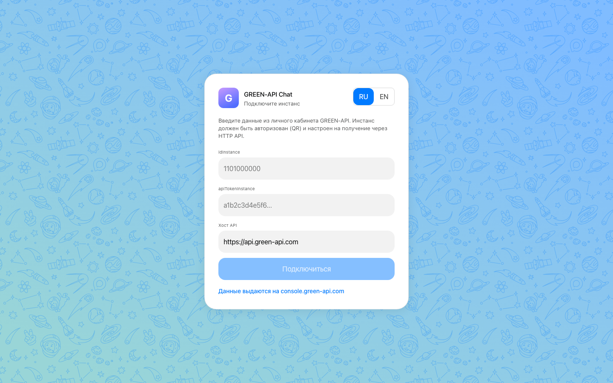
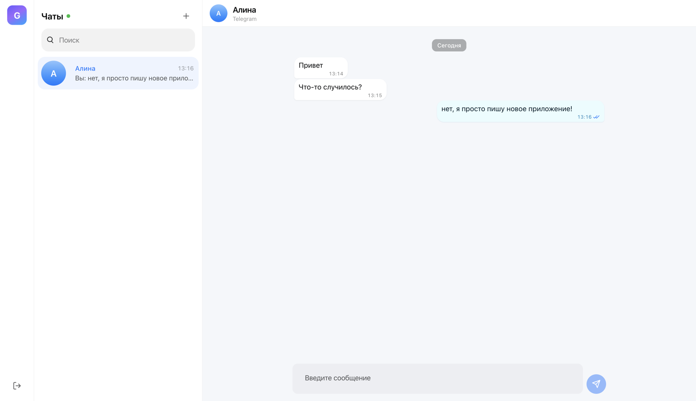
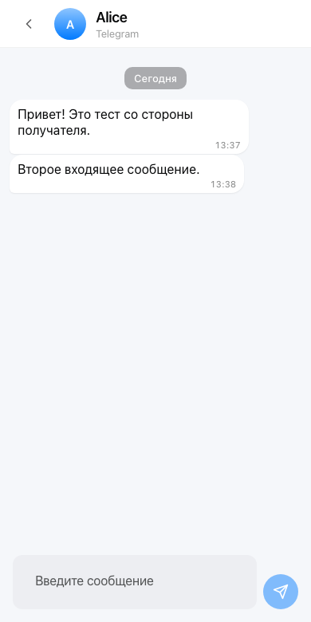

# GREEN-API Chat (Telegram)

Минимальный чат на React для отправки и получения **текстовых** сообщений
Telegram через шлюз [GREEN-API](https://green-api.com/telegram/docs/).

Задание допускает MAX / WhatsApp / Telegram. Здесь канал - **Telegram**
(почему именно он - ниже). Слой API общий: GREEN-API использует один формат
запросов (`waInstance{idInstance}/<method>/{apiTokenInstance}`) для Telegram,
WhatsApp и MAX, поэтому приложение переключается на другой мессенджер сменой
instance и `apiUrl`.

**Демо:** https://green-api-telegram-chat-two.vercel.app

> **Коротко про выбор канала.** MAX из Казахстана не даёт написать первым тому,
> кто не добавил тебя в контакты, а сценарий задания именно про первое
> сообщение. Задание разрешает фолбэк, поэтому канал - Telegram. Код при этом
> общается с GREEN-API через общий слой, одинаковый для Telegram/WhatsApp/MAX.

## Что умеет

- Подключение по `idInstance` + `apiTokenInstance` (+ хост `apiUrl`) с
  проверкой через `getStateInstance` и автонастройкой HTTP API (`setSettings`).
- Создание чата по номеру телефона (`checkAccount` -> `chatId`).
- Отправка текста (`sendMessage`) с оптимистичным пузырём и сверкой по `idMessage`.
- Приём сообщений через long-poll `receiveNotification` + `deleteNotification`,
  дедупликация по `idMessage`.
- Статусы исходящих (`outgoingMessageStatus`): sent / delivered / read / failed.
- Список чатов, непрочитанные, поиск, разделители по дням, RU/EN.

Всё только текст, как и просит задание.

## Почему Telegram

MAX из Казахстана до сценария задачи не доводит. Зарегистрироваться по KZ-номеру
можно, но для номеров не из РФ и РБ MAX режет первый контакт: не начать чат с
тем, кто не добавил тебя в контакты. А весь сценарий как раз про первое
сообщение, ввёл номер и написал первым. С KZ-номером **Telegram** этого
ограничения не имеет, и задание разрешает такой фолбэк.

MAX при этом никуда не делся. Код ходит в GREEN-API через общий слой
(`sendMessage`, `receiveNotification` + `deleteNotification`), одинаковый для
Telegram, WhatsApp и MAX. Чтобы переключиться на MAX, нужны только его instance
и `apiUrl`: канал в коде задан одной константой (`src/config.ts`). Если
получатель напишет первым (или добавит в контакты), тот же обмен send/receive
пойдёт в MAX.

## Внешний вид

За прототип взят внешний вид чата [web.max.ru](https://web.max.ru/). Интерфейс
собран на официальном UI Kit MAX
**[@maxhub/max-ui](https://www.npmjs.com/package/@maxhub/max-ui)** и токенах
дизайн-системы MAX (см. `docs/design-kit.md`). Марка приложения: своя «G» на
фирменном градиенте MAX (`--gradient-purple`), favicon в той же гамме.





## Стек

- **React 18 + TypeScript + Vite**
- **[@maxhub/max-ui](https://www.npmjs.com/package/@maxhub/max-ui)** - официальный UI Kit
  мессенджера MAX. Кнопки, поля, ячейки списка и аватары здесь - родные
  компоненты MAX, со своим `styles.css`.
- **Redux Toolkit + RTK Query** (тот же паттерн опроса, что в `green-api/green-api-chat`)
- **i18next / react-i18next** (ru, en)
- **Sass**
- **Vitest + Testing Library + Playwright (E2E)**

## Как работает приём сообщений

```
receiveNotification (long-poll, receiveTimeout=10s)
        │  есть уведомление?
        ├── нет  -> пауза 1s -> повтор
        └── да   -> разобрать body
                    ├ incomingMessageReceived + textMessage -> пузырь в чат
                    └ outgoingMessageStatus -> обновить статус
                    -> deleteNotification(receiptId)  // подтверждение
```

Опрос всегда одиночный (цикл ждёт ответа), очередь FIFO консистентна.
Повторная доставка (если `deleteNotification` не прошёл) отсекается дедупом.

## Локальный запуск

Требуется Node.js 18+ (проверено на Node 26) и npm/pnpm.

```bash
# 1. Установить зависимости
pnpm install        # или: npm install

# 2. Запустить dev-сервер
pnpm dev            # или: npm run dev
# откроется http://localhost:5173

# 3. Продакшн-сборка (по желанию)
pnpm build && pnpm preview
```

### Тесты и проверки

```bash
pnpm test:run       # Vitest - 49 unit-тестов
pnpm e2e            # Playwright - 3 E2E-сценария (подключение, отправка/приём, мобильный)
pnpm lint           # ESLint
pnpm typecheck      # tsc --noEmit
pnpm build          # typecheck + production build
```

## Подготовка инстанса GREEN-API

1. Откройте мобильный **Telegram** и войдите в аккаунт, с которого будете писать.
2. Зарегистрируйтесь на [console.green-api.com](https://console.green-api.com)
   и создайте инстанс Telegram (тариф **Developer** бесплатный).
3. Авторизуйте инстанс в личном кабинете: QR-кодом с телефона или входом по
   коду, если сканера под рукой нет.
4. Скопируйте `idInstance` и `apiTokenInstance` и вставьте их в форму подключения.

> Получение входящих через HTTP API включается автоматически: при подключении
> приложение вызывает `setSettings` с пустым `webhookUrl`.

## Docker

```bash
docker build -t green-api-chat .
docker run --rm -p 8080:80 green-api-chat
# http://localhost:8080
```

## Деплой

Живая сборка: **https://green-api-telegram-chat-two.vercel.app**. Редеплой из
этой папки:

```bash
vercel deploy --prod --yes
```

Сборку Vercel берёт из `vercel.json`: команда `pnpm build`, каталог `dist`, все
пути отдают `index.html` (SPA).

## Структура

```
src/
  api/            типизированный клиент GREEN-API (RTK Query baseQuery + endpoints)
  app/            store, типизированные хуки, персист креденшелов
  features/
    credentials/  idInstance / apiToken / apiUrl
    connection/   проверка инстанса, setSettings, авто-подключение
    chats/        чаты и сообщения, дедуп, разбор уведомлений
    messaging/    отправка с оптимистичным обновлением
    receiver/     long-poll цикл получения
  components/     UI: подключение, список чатов, окно чата, композер
  i18n/           ru / en
  styles/         глобальные стили (Sass) + kit дизайн-системы MAX (styles/max/)
docs/task/        исходное ТЗ (скриншоты)
docs/tz.md        выписанные требования задания
docs/design-kit.md  дизайн-система MAX (токены, компоненты)
docs/screenshots/   скриншоты приложения
docs/walkthrough/   пошаговый user-way + лог сети
e2e/              Playwright: тесты, live-режим, walkthrough
```

## Ограничения

- Только текст (по условию задания).
- Креденшелы хранятся в `localStorage` браузера и уходят напрямую в
  `api.green-api.com` (CORS у шлюза открыт). Для тестового это ожидаемо; в
  продакшне токен обычно прячут за бэкенд-прокси.

## Лицензия

MIT
